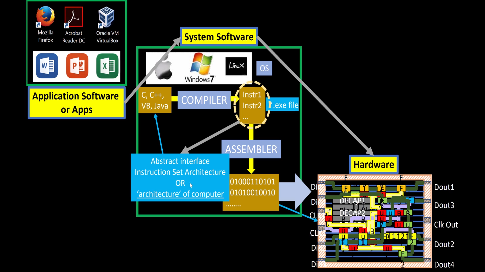
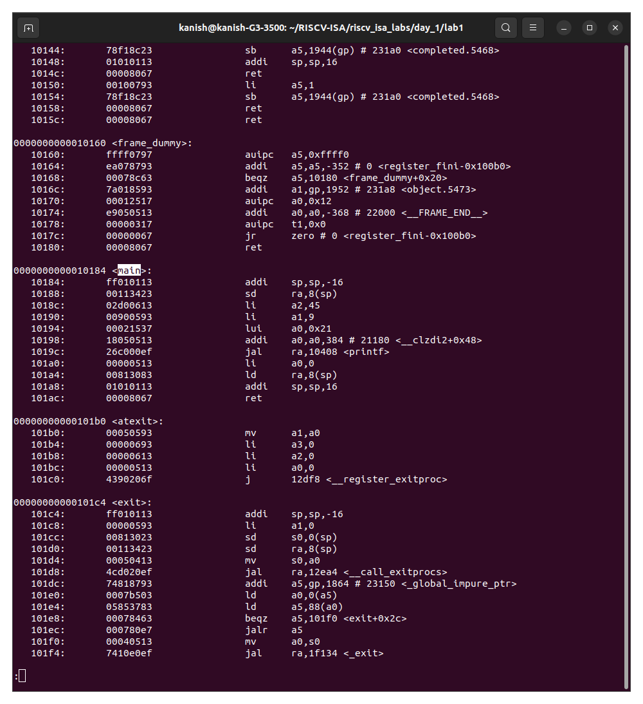
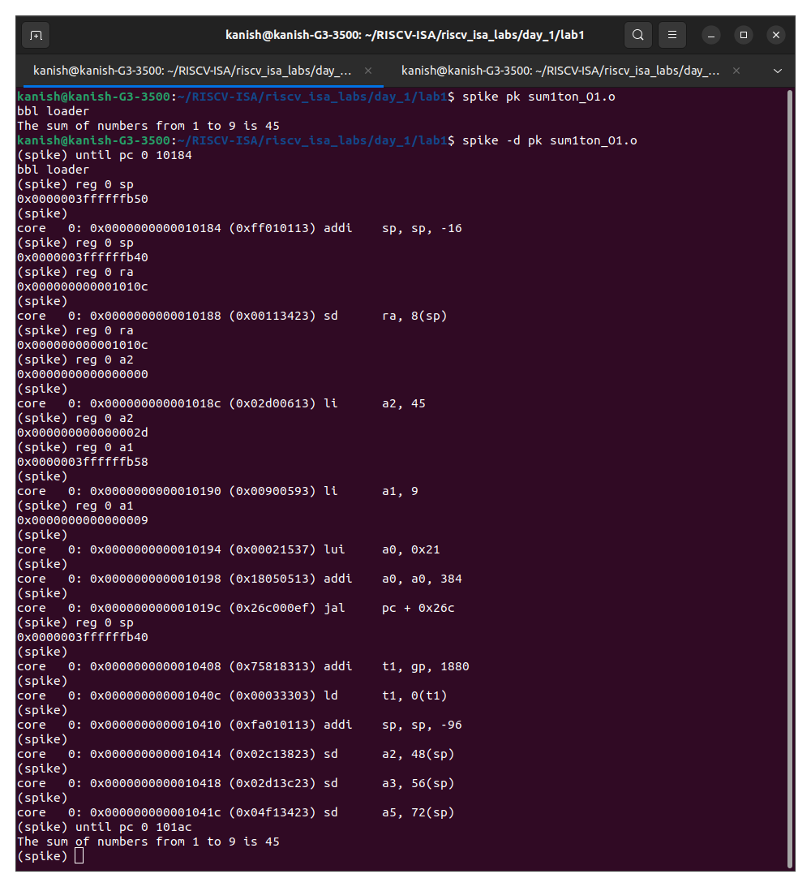
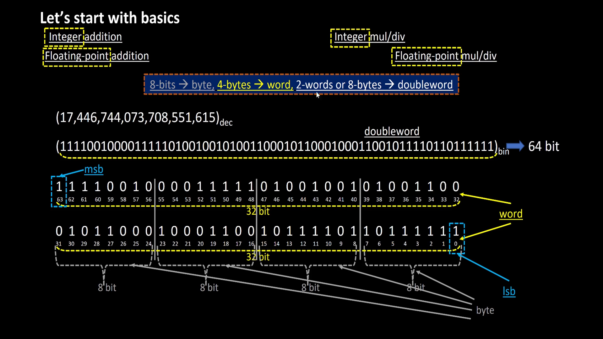
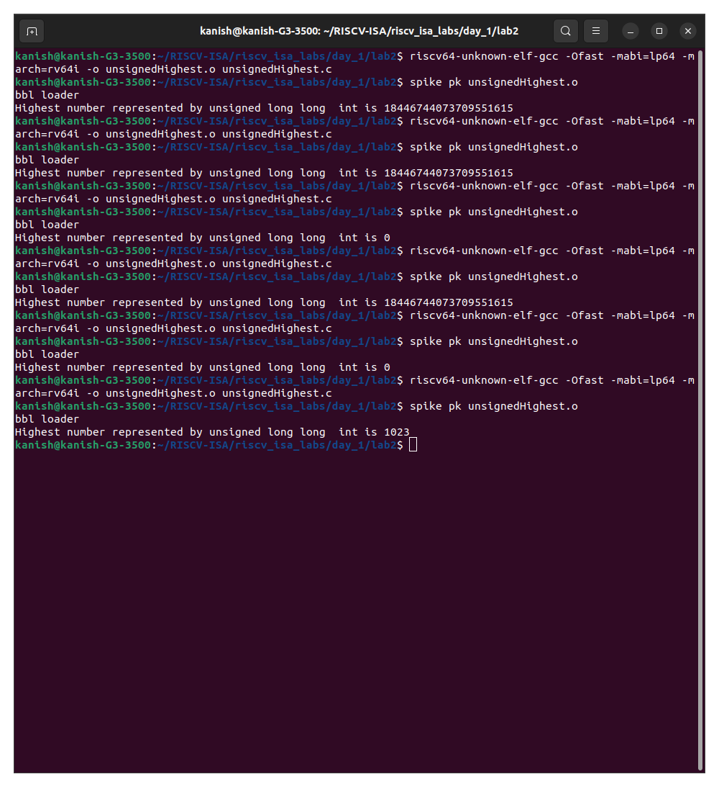

# RISCV-ISA

## Table of Contents
- [Day - 1 : Introduction to RISC-V ISA and GNU compiler toolchain](#day---1--introduction-to-risc-v-isa-and-gnu-compiler-toolchain)
    * [Tool Installation](#tool-installation)
    * [Instruction Set Architecture (ISA)](#instruction-set-architecture-isa)
    * [RISC-V ISA](#riscv-isa)
    * [Application Software on Hardware flow](#application-software-on-hardware-flow)
    * [Illustration of the RISC-V gnu toolchain](#illustration-of-the-risc-v-gnu-toolchain)
        + [O1 mode](#o1-mode)
        + [Ofast mode](#ofast-mode)
    * [Data Representation](#data-representation)
    * [Representation of Signed and Unsigned Numbers](#representation-of-signed-and-unsigned-numbers)
        + [Signed Numbers](#signed-numbers)
        + [Unsigned Numbers](#unsigned-numbers)
    * [Illustration of Signed and Unsigned Numbers in RISC-V](#illustration-of-signed-and-unsigned-numbers-in-risc-v)
        + [Unsigned Numbers](#unsigned-numbers-1)
        + [Signed Numbers](#signed-numbers-1)

- [Day - 2 : ]
- [Day - 3 : ]
- [Day - 4 : ]
- [Day - 5 : ]
- [Acknowledgement](#acknowledgement)
- [References](#references)

## Day - 1 : Introduction to RISC-V ISA and GNU compiler toolchain

### Tool Installation
Install the dependencies using the following command :
```
sudo apt-get install libboost-regex-dev
```

**Steps to install the toolchain**
```
git clone https://github.com/kunalg123/riscv_workshop_collaterals.git
cd riscv_workshop_collaterals
chmod +x run.sh
./run.sh
```

Running this command will result in a make error. Ignore the error and follow the steps given below:

```
cd ~/riscv_toolchain/iverilog/
git checkout --track -b v10-branch origin/v10-branch
git pull 
chmod 777 autoconf.sh 
./autoconf.sh 
./configure 
make
sudo make install 
```

Once the toolchain is installed it is necessary to create a PATH variable in bashrc file. To create the path variable follow the steps given below :

```
gedit .bashrc
#Instead of kanish put your username

#Type at last line
export PATH="/home/kanish/riscv_toolchain/riscv64-unknown-elf-gcc-8.3.0-2019.08.0-x86_64-linux-ubuntu14/bin:$PATH" 

# close the bashrc and type in terminal
source .bashrc
```
### Instruction Set Architecture (ISA)
An Instruction Set Architecture (ISA) is like the blueprint of a computer's brain . It's the link between the software  and the hardware it runs on, explaining both the capabilities of the processor and the steps to carry out tasks. . It's what programmers using assembly language, compilers, and applications refer to. The ISA covers things like the types of data a computer can handle, special storage areas called registers, how the computer handles memory, important features like virtual memory, the set of tasks a tiny computer within the processor can perform, and how the computer talks to other devices. It can also grow by adding new tasks or abilities, like understanding bigger chunks of data. Understanding what the instruction set can do and how a compiler uses these instructions helps developers write code that uses resources effectively. It also helps them make sense of the compiler's results, which is useful for finding and fixing mistakes.

### RISC-V ISA
RISC-V (Reduced Instruction Set Computing - Five) is  as a novel instruction set architecture (ISA) initially crafted to support research and education in computer architecture. The RISC-V ISA consists of a foundational base integer ISA, mandatory in any implementation, along with optional extensions that can be added to the base ISA. The base integer ISA closely resembles early RISC processors but eliminates branch delay slots and introduces support for optional variable-length instruction encodings. The base is meticulously limited to a minimal set of instructions, sufficient to serve as a practical target for compilers, assemblers, linkers, and operating systems (with supplementary supervisor-level operations). This approach creates a practical ISA and software toolchain "framework" that can be customized to form more specialized processor ISAs.
The base integer ISA is named “I” (prefixed by RV32 or RV64 depending on integer register width), and contains integer computational instructions, integer loads, integer stores, and control-flow instructions, and is mandatory for all RISC-V implementations. The standard integer multiplication and division extension is named “M”, and adds instructions to multiply and divide values held in the integer registers. The standard atomic instruction extension, denoted by “A”, adds instructions that atomically read, modify, and write memory for inter-processor synchronization. The standard single-precision floating-point extension, denoted by “F”, adds floating-point registers, single-precision computational instructions, and single-precision loads and stores. The standard double-precision floating-point extension, denoted by “D”, expands the floating-point registers, and adds double-precision computational instructions, loads, and stores. An integer base plus these four standard extensions (“IMAFD”) is given the abbreviation “G” and provides a general-purpose scalar instruction set.

To know more about RISC-V check on this link [here](https://riscv.org/wp-content/uploads/2017/05/riscv-spec-v2.2.pdf).


### Application Software on Hardware Flow 



When a C program needs to run on a hardware chip, it goes through a series of steps. First, the C program is turned into assembly language, specifically RISCV assembly language in this case. Then, this assembly language is transformed into machine language consisting of 0s and 1s. These binary instructions are what the chip understands and executes. There's a bridge between the RISCV assembly language and the physical layout of the chip. This bridge is made using Hardware Description Language, which is more closely related to the hardware's workings. To create a RISC specification, the architecture needs to be implemented in a way that registers transfer data. This process involves converting from RTL (Register Transfer Level) to the layout, a process known as RTL to GDSII flow. This ensures that all applications function properly on the hardware.

To make an application work on the hardware, it has to pass through the software system. Here, the system software comes into play, which includes the Operating System (OS), compiler, and assembler. The OS handles tasks like input/output and memory allocation, while the compiler turns the high-level code (like C or C++) into a set of instructions. These instructions depend on the hardware's structure. For a RISC-V system, the instructions follow the RISC-V architecture. The assembler then takes these instructions and turns them into a binary form, which is basically a machine language program. This binary representation is what the hardware ultimately receives and processes. These instructions act as a link between the C language and the intricate hardware components. This link is formally called the Instruction Set Architecture (ISA). In hardware's language, only 0s and 1s make sense, and they serve as the foundation for communication between software and hardware.

### Illustration of the RISC-V gnu toolchain

#### O1 mode 
Consider the simple C program given below which calculates the sum of the number form 1 to n. 

```
#include<stdio.h>
int main()
{
    int i ,sum=0,n=9;
    for (i=1;i<=n;i++)
        sum+=i;
    printf("The sum of numbers from 1 to %d is %d\n",n,sum);
    return 0;
}
```
In order to map this command to riscv based assembly language compile it using the riscv-gnu-toolchain shown below

```
cd /home/kanish/RISCV-ISA/riscv_isa_labs/day_1/lab1
riscv64-unknown-elf-gcc -O1 -mabi=lp64 -march=rv64i -o sum1ton_O1.o sum1ton.c
riscv64-unknown-elf-objdump -d sum1ton_O1.o | less
spike pk sum1ton_O1.o 
```

**Output of the disassembled file**


To view the address of the subroutine (line main() or printf()) type ```/main``` (if main()) or ```/printf```(if printf()).
To quit type ```:q```.

___
***Explanation of the commands :***

**riscv64-unknown-elf-gcc** - RISC-V architecture based gcc compiler .

**-O1/-Ofast** - This flag specifies the optimization level to be used during compilation. In this case, the level is set to 1, which represents a basic level of optimization. Higher optimization levels (like -O2 or -O3) can potentially result in more optimized and faster code, but they might also increase compilation time.-Ofast is an optimization level flag used in GCC (GNU Compiler Collection) to enable aggressive optimizations that go beyond the optimizations performed by -O3.

**-mabi=lp64** - Specify integer and floating-point calling convention. ABI-string contains two parts: the size of integer types and the registers used for floating-point types. "lp64" ABI stands for "Long and Pointer 64-bit," indicating that long integers and pointers are 64 bits in size.

**-march=rv64i** - Generate code for given RISC-V ISA. ISA strings must be lower-case. Examples include ‘rv64i’, ‘rv32g’, ‘rv32e’, and ‘rv32imaf’. In this case, "rv64i" specifies a 64-bit RISC-V architecture with the "i" extension, which denotes the base integer instruction set.

**-o sum1ton_O1.o** - This flag indicates the name of the output file after compilation. In this case, the compiled code will be saved as "sum1ton_O1.o".

**sum1ton.c** - This is the source code file that you want to compile. In this case, it's named "sum1ton.c".

**riscv64-unknown-elf-objdump** - This is the command-line utility used for examining the contents of object files, executables, and libraries. It can provide information about the disassembled machine code, symbol tables, and more.

**-d** - This flag specifies that the disassembly mode should be used. In other words, you are requesting to see the disassembled machine code instructions corresponding to the binary content in the object file.

**sum1ton_O1.o** - This is the object file that you want to disassemble. It contains the compiled machine code generated from the "sum1ton.c" source code file using the specified compiler options.

**spike** -  Spike is a RISC-V ISA simulator that emulates the behavior of a RISC-V processor. It's used to run RISC-V binary programs on a host machine, simulating how those programs would execute on actual RISC-V hardware.

**pk** - The "proxy kernel" (pk) is a small user-mode runtime environment that provides a basic set of functionalities needed to execute programs in the Spike simulator. It serves as a minimal operating system interface for the simulated environment. The proxy kernel handles basic interactions with the simulated environment, such as managing memory, handling system calls, and providing essential runtime support.

___

To debug line by line
```
spike -d pk sum1ton_O1.o 
until pc 0 10184
reg 0 sp
#Press enter for line by line execution
reg 0 a2
```

___
***Explanation of the commands :***

**-d (in spike command)** - indicates spike in debug mode. Debug mode enables you to closely monitor and interact with the simulated program's execution, making it useful for analyzing code behavior, identifying issues, and stepping through instructions.

**until pc 0 10184** - continue executing the program until the program counter reaches address 10184. 

**reg 0 sp** - Inquire about the value stored in register., in this case it is stack pointer (sp)
___

**Output of the spike in debug mode is shown below :**


#### Ofast mode
Consider the same [C program](#o1-mode) given in the O1 mode.

In order to map this command to riscv based assembly language compile it in Ofast mode using the riscv-gnu-toolchain shown below

```
cd /home/kanish/RISCV-ISA/riscv_isa_labs/day_1/lab1
riscv64-unknown-elf-gcc -Ofast -mabi=lp64 -march=rv64i -o sum1ton_Ofast.o sum1ton.c
riscv64-unknown-elf-objdump -d sum1ton_Ofast.o | less
spike pk sum1ton_Ofast.o 
```

**Output of the disassembled file**


**Observation** - The same C code compiled in Ofast mode used less number of instruction compared to the O1 mode.

### Data Representation


In RISC-V and computer architecture in general, several terms relate to data representation and storage. Let's explore them:

1. **Byte:** - A byte is the fundamental unit of data storage and representation in computers. It consists of 8 bits and can represent a single character or value.

2. **Word:** - A word typically refers to the natural data size that a processor operates with. In RISC-V, the term "word" can vary based on the architecture. For example, in RV32 (32-bit architecture), a word is 4 bytes (32 bits), while in RV64 (64-bit architecture), a word is 8 bytes (64 bits).

3. **Double Word:** - A double word is twice the size of a word. In RISC-V, for example, in RV32, a double word is 8 bytes (64 bits), and in RV64, a double word is 16 bytes (128 bits).

4. **Least Significant Bit (LSB):** -  The least significant bit is the lowest-order bit in a binary representation. 

5. **Most Significant Bit (MSB):** -  The most significant bit is the highest-order bit in a binary representation. It has the greatest influence on the overall value of a number. The MSB is the bit that represents the largest power of two.


6. **Endianess:** - Endianess refers to how multi-byte data is stored in memory. In a big-endian system, the most significant byte is stored at the lowest memory address, while in a little-endian system, the least significant byte is stored at the lowest memory address. RISC-V supports both big-endian and little-endian modes.

Understanding these terms is crucial when working with data representation, memory allocation, and programming in computer systems, including the RISC-V architecture.

7. **Byte addressing** -  is a memory addressing scheme used in computer systems to identify and access individual bytes of data within the computer's memory. In byte addressing, each individual byte in the memory has a unique address, allowing direct access to and manipulation of single bytes of data. In RISC-V, like in many other computer architectures, memory is byte-addressable.

### Representation of Signed and Unsigned Numbers
#### Unsigned Numbers
Unsigned numbers don’t have any sign, these can contain only magnitude of the number. So, representation of unsigned binary numbers are all positive numbers only.
Since there is no sign bit in this unsigned binary number, so N bit binary number represent its magnitude only. Zero (0) is also unsigned number. Every number in unsigned number representation has only one unique binary equivalent form, so this is unambiguous representation technique. The range of unsigned binary number is from  **0 to (2^n-1)**.

#### Signed Numbers
Generally 2's complement representation is used for the signed numbers. 2’s complement of a number is obtained by inverting each bit of given number plus 1 to least significant bit (LSB). So, positive numbers are represented in binary form and negative numbers are represented in 2’s complement form. There is extra bit for sign representation. If value of sign bit is 0, then number is positive and you can directly represent it in simple binary form, but if value of sign bit 1, then number is negative and 2’s complement of given binary number should be taken. In this representation, zero (0) has only one (unique) representation which is always positive. The range of 2’s complement form is from  **(-2^(n-1))  to ((2^(n-1))-1)**.

### Illustration of Signed and Unsigned Numbers in RISC-V
#### Unsigned Numbers

Consider the C code given below which demostrates the maximum unsigned number the RV64I can store. 

```
#include<stdio.h>
#include<math.h>

int main()
{
    unsigned long long int max = (unsigned long long int)(pow(2,64)-1); //Line 1
    // unsigned long long int max = (unsigned long long int)(pow(2,127)-1);// Line 2
    // unsigned long long int max = (unsigned long long int)(pow(2,64)*-1);// Line 3
    // unsigned long long int max = (unsigned long long int)(pow(-2,64)-1);// Line 4
    // unsigned long long int max = (unsigned long long int)(pow(-2,63)-1);// Line 5
    // unsigned long long int max = (unsigned long long int)(pow(2,10)-1);// Line 6
    printf("Highest number represented by unsigned long long  int is %llu \n",max);
    return 0;
}
```
___
***Note**</br.>

**%llu** - is the format specifier for 64-bit unsigned integer.

**%lld** - is the format specifier for 64-bit signed integer.

Uncomment the lines in the code appropriately and view the result.
___
Line 1 will execute and give the result of (2^64)-1.</br>
Line 2 will execute and give the result of (2^64)-1 instead of (2^127)-1 since the maximum unsigned value that can be stored in the 64 bit register is (2^64)-1.</br>
Line 3 will execute and give the result of 0 instead of -(2^64) since the minimum unsigned value that can be stored in 64 bit register is 0.</br>
Line 4 will execute and give the result of 0 instead of (2^64)-1.</br>
Line 5 will execute and give the result of 0 instead of -(2^64) since the minimum unsigned value that can be stored in 64 bit register is 0.</br>
Line 6 will execute and give the result of 1024 since the value of max is less that (2^64)-1.

To compile and execute the C code in RISC-V gnu toolchain follow the steps given below:

```
cd /home/kanish/RISCV-ISA/riscv_isa_labs/day_1/lab2
riscv64-unknown-elf-gcc -Ofast -mabi=lp64 -march=rv64i -o unsignedHighest.o unsignedHighest.c 
spike  pk unsignedHighest.o 
```

**Output of the execution**


#### Signed Numbers

Consider the C code given below which demostrates the maximum and minimum signed number the RV64I can store. 


```
#include<stdio.h>
#include<math.h>

int main()
{
    long long int max = (long long int)(pow(2,63)-1);
    long long int min = (long long int)(pow(-2,63));
    printf("Highest number represented by long long  int is %lld \n",max);
    printf("Smallest number represented by long long  int is %lld \n",min);
    return 0;
}
```
To compile and execute the C code in RISC-V gnu toolchain follow the steps given below:

```
cd /home/kanish/RISCV-ISA/riscv_isa_labs/day_1/lab2
riscv64-unknown-elf-gcc -Ofast -mabi=lp64 -march=rv64i -o signedHighest.o unsignedHighest.c 
spike  pk signedHighest.o 
```
**Output of the execution**


[Acknowledgement Section]:#
## Acknowledgement
1. Kunal Ghosh, VSD Corp. Pvt. Ltd.
2. Sumanto Kar, Sr. Project Technical Assistant , IIT Bombay
3. Alwin Shaju, Colleague IIITB
4. Adam Teman, Associate Professor at Bar-Ilan University in Ramat Gan, Israel   


[Reference Section]:#
## References
1. https://www.eng.biu.ac.il/temanad/digital-vlsi-design/
2. https://www.arm.com/glossary/isa
3. https://riscv.org/wp-content/uploads/2017/05/riscv-spec-v2.2.pdf
4. https://gcc.gnu.org/onlinedocs/gcc/RISC-V-Options.html
5. https://www.tutorialspoint.com/unsigned-and-signed-binary-numbers