# RISCV-ISA

## Table of Contents
- [Day - 1 : Introduction to RISC-V ISA and GNU compiler toolchain](#day---1--introduction-to-risc-v-isa-and-gnu-compiler-toolchain)
    * [Tool Installation](#tool-installation)
    * [Instruction Set Architecture (ISA)](#instruction-set-architecture-isa)
    * [RISC-V ISA](#riscv-isa)
    * [Application Software on Hardware flow](#application-software-on-hardware-flow)
    * [Illustration of the RISC-V gnu toolchain](#illustration-of-the-risc-v-gnu-toolchain)
        + [O1 mode](#o1-mode)
        + [Ofast mode](#ofast-mode)
    * [Data Representation](#data-representation)
    * [Representation of Signed and Unsigned Numbers](#representation-of-signed-and-unsigned-numbers)
        + [Signed Numbers](#signed-numbers)
        + [Unsigned Numbers](#unsigned-numbers)
    * [Illustration of Signed and Unsigned Numbers in RISC-V](#illustration-of-signed-and-unsigned-numbers-in-risc-v)
        + [Unsigned Numbers](#unsigned-numbers-1)
        + [Signed Numbers](#signed-numbers-1)
- [Day - 2 : Introduction to ABI and Basic Verification Flow](#day---2--introduction-to-abi-and-basic-verification-flow)
    * [RV64I Base Integer Instruction Set](#rv64i-base-integer-instruction-set)
    * [Application Binary Interface (ABI)](#application-binary-interface-abi)
    * [Illustration of ABI](#illustration-of-abi)
- [Day - 3 : Digital Logic with TL-Verilog and Makerchip](#day---3--digital-logic-with-tl-verilog-and-makerchip)
    * [Logic Gates](#logic-gates)
    * [Multiplexer using Ternary Operator](#day---3--digital-logic-with-tl-verilog-and-makerchip)
    * [Transaction Level (TL) - Verilog](#transaction-leveltl---verilog)
    * [Makerchip](#makerchip)
    * [Basic Combinational Circuits in Makerchip](#basic-combinational-circuits-in-makerchip)
        + [Pythagorean Example Demo](#pythagorean-example-demo)
        + [Inverter](#inverter)
        + [AND gate](#and-gate)
        + [OR gate](#or-gate)
        + [XOR gate](#xor-gate)
        + [Vector Addition](#vector-addition)
        + [2:1 Multiplexer](#21-multiplexer)
        + [2:1 Vector Multiplexer](#21-vector-multiplexer)
        + [Calculator](#calculator)
    * [Sequential Circuits](#sequential-circuits)
    * [Basic Sequential Circuits in Makerchip](#basic-sequential-circuits-in-makerchip)
        + [Fibonacci Series](#fibonacci-series)
        + [Free Running Counter](#free-running-counter)
        + [Counter-Output with Calculator Integeration](#counter-output-with-calculator-integration)
        + [Sequential Calculator](#sequential-calculator)
    * [Pipelining]
    * [Identifiers and Types in TL Verilog](#identifiers-and-types-in-tl-verilog)
    * [Basic Pipelined Circuits](#basic-pipelined-circuits)
        + [Pipelined Pythagorean](#pipelined-pythagorean)
        + [Error Detection Demo](#error-detection-demo)
        + [Counter and Calculator in Pipeline](#counter-and-calculator-in-pipeline)
        + [2 Cycle Calculator](#2-cycle-calculator)
    * [Validity](#validity)
    * [Clock Gating](#clock-gating)
- [Day - 4 : ]
- [Day - 5 : ]
- [Acknowledgement](#acknowledgement)
- [References](#references)

## Day - 1 : Introduction to RISC-V ISA and GNU compiler toolchain

### Tool Installation
Install the dependencies using the following command :
```
sudo apt-get install libboost-regex-dev
```

**Steps to install the toolchain**
```
git clone https://github.com/kunalg123/riscv_workshop_collaterals.git
cd riscv_workshop_collaterals
chmod +x run.sh
./run.sh
```

Running this command will result in a make error. Ignore the error and follow the steps given below:

```
cd ~/riscv_toolchain/iverilog/
git checkout --track -b v10-branch origin/v10-branch
git pull 
chmod 777 autoconf.sh 
./autoconf.sh 
./configure 
make
sudo make install 
```

Once the toolchain is installed it is necessary to create a PATH variable in bashrc file. To create the path variable follow the steps given below :

```
gedit .bashrc
#Instead of kanish put your username

#Type at last line
export PATH="/home/kanish/riscv_toolchain/riscv64-unknown-elf-gcc-8.3.0-2019.08.0-x86_64-linux-ubuntu14/bin:$PATH" 

# close the bashrc and type in terminal
source .bashrc
```
### Instruction Set Architecture (ISA)
An Instruction Set Architecture (ISA) is like the blueprint of a computer's brain . It's the link between the software  and the hardware it runs on, explaining both the capabilities of the processor and the steps to carry out tasks. . It's what programmers using assembly language, compilers, and applications refer to. The ISA covers things like the types of data a computer can handle, special storage areas called registers, how the computer handles memory, important features like virtual memory, the set of tasks a tiny computer within the processor can perform, and how the computer talks to other devices. It can also grow by adding new tasks or abilities, like understanding bigger chunks of data. Understanding what the instruction set can do and how a compiler uses these instructions helps developers write code that uses resources effectively. It also helps them make sense of the compiler's results, which is useful for finding and fixing mistakes.

### RISC-V ISA
RISC-V (Reduced Instruction Set Computing - Five) is  as a novel instruction set architecture (ISA) initially crafted to support research and education in computer architecture. The RISC-V ISA consists of a foundational base integer ISA, mandatory in any implementation, along with optional extensions that can be added to the base ISA. The base integer ISA closely resembles early RISC processors but eliminates branch delay slots and introduces support for optional variable-length instruction encodings. The base is meticulously limited to a minimal set of instructions, sufficient to serve as a practical target for compilers, assemblers, linkers, and operating systems (with supplementary supervisor-level operations). This approach creates a practical ISA and software toolchain "framework" that can be customized to form more specialized processor ISAs.
The base integer ISA is named “I” (prefixed by RV32 or RV64 depending on integer register width), and contains integer computational instructions, integer loads, integer stores, and control-flow instructions, and is mandatory for all RISC-V implementations. The standard integer multiplication and division extension is named “M”, and adds instructions to multiply and divide values held in the integer registers. The standard atomic instruction extension, denoted by “A”, adds instructions that atomically read, modify, and write memory for inter-processor synchronization. The standard single-precision floating-point extension, denoted by “F”, adds floating-point registers, single-precision computational instructions, and single-precision loads and stores. The standard double-precision floating-point extension, denoted by “D”, expands the floating-point registers, and adds double-precision computational instructions, loads, and stores. An integer base plus these four standard extensions (“IMAFD”) is given the abbreviation “G” and provides a general-purpose scalar instruction set.

To know more about RISC-V check on this link [here](https://riscv.org/wp-content/uploads/2017/05/riscv-spec-v2.2.pdf).


### Application Software on Hardware Flow 


When a C program needs to run on a hardware chip, it goes through a series of steps. First, the C program is turned into assembly language, specifically RISCV assembly language in this case. Then, this assembly language is transformed into machine language consisting of 0s and 1s. These binary instructions are what the chip understands and executes. There's a bridge between the RISCV assembly language and the physical layout of the chip. This bridge is made using Hardware Description Language, which is more closely related to the hardware's workings. To create a RISC specification, the architecture needs to be implemented in a way that registers transfer data. This process involves converting from RTL (Register Transfer Level) to the layout, a process known as RTL to GDSII flow. This ensures that all applications function properly on the hardware.

To make an application work on the hardware, it has to pass through the software system. Here, the system software comes into play, which includes the Operating System (OS), compiler, and assembler. The OS handles tasks like input/output and memory allocation, while the compiler turns the high-level code (like C or C++) into a set of instructions. These instructions depend on the hardware's structure. For a RISC-V system, the instructions follow the RISC-V architecture. The assembler then takes these instructions and turns them into a binary form, which is basically a machine language program. This binary representation is what the hardware ultimately receives and processes. These instructions act as a link between the C language and the intricate hardware components. This link is formally called the Instruction Set Architecture (ISA). In hardware's language, only 0s and 1s make sense, and they serve as the foundation for communication between software and hardware.

### Illustration of the RISC-V gnu toolchain

#### O1 mode 
Consider the simple C program given below which calculates the sum of the number form 1 to n. 

```
#include<stdio.h>
int main()
{
    int i ,sum=0,n=9;
    for (i=1;i<=n;i++)
        sum+=i;
    printf("The sum of numbers from 1 to %d is %d\n",n,sum);
    return 0;
}
```
In order to map this command to riscv based assembly language compile it using the riscv-gnu-toolchain shown below

```
cd /home/kanish/RISCV-ISA/riscv_isa_labs/day_1/lab1
riscv64-unknown-elf-gcc -O1 -mabi=lp64 -march=rv64i -o sum1ton_O1.o sum1ton.c
riscv64-unknown-elf-objdump -d sum1ton_O1.o | less
spike pk sum1ton_O1.o 
```

**Output of the disassembled file**


To view the address of the subroutine (line main() or printf()) type ```/main``` (if main()) or ```/printf```(if printf()).
To quit type ```:q```.

___
***Explanation of the commands :***

**riscv64-unknown-elf-gcc** - RISC-V architecture based gcc compiler .

**-O1/-Ofast** - This flag specifies the optimization level to be used during compilation. In this case, the level is set to 1, which represents a basic level of optimization. Higher optimization levels (like -O2 or -O3) can potentially result in more optimized and faster code, but they might also increase compilation time.-Ofast is an optimization level flag used in GCC (GNU Compiler Collection) to enable aggressive optimizations that go beyond the optimizations performed by -O3.

**-mabi=lp64** - Specify integer and floating-point calling convention. ABI-string contains two parts: the size of integer types and the registers used for floating-point types. "lp64" ABI stands for "Long and Pointer 64-bit," indicating that long integers and pointers are 64 bits in size.

**-march=rv64i** - Generate code for given RISC-V ISA. ISA strings must be lower-case. Examples include ‘rv64i’, ‘rv32g’, ‘rv32e’, and ‘rv32imaf’. In this case, "rv64i" specifies a 64-bit RISC-V architecture with the "i" extension, which denotes the base integer instruction set.

**-o sum1ton_O1.o** - This flag indicates the name of the output file after compilation. In this case, the compiled code will be saved as "sum1ton_O1.o".

**sum1ton.c** - This is the source code file that you want to compile. In this case, it's named "sum1ton.c".

**riscv64-unknown-elf-objdump** - This is the command-line utility used for examining the contents of object files, executables, and libraries. It can provide information about the disassembled machine code, symbol tables, and more.

**-d** - This flag specifies that the disassembly mode should be used. In other words, you are requesting to see the disassembled machine code instructions corresponding to the binary content in the object file.

**sum1ton_O1.o** - This is the object file that you want to disassemble. It contains the compiled machine code generated from the "sum1ton.c" source code file using the specified compiler options.

**spike** -  Spike is a RISC-V ISA simulator that emulates the behavior of a RISC-V processor. It's used to run RISC-V binary programs on a host machine, simulating how those programs would execute on actual RISC-V hardware.

**pk** - The "proxy kernel" (pk) is a small user-mode runtime environment that provides a basic set of functionalities needed to execute programs in the Spike simulator. It serves as a minimal operating system interface for the simulated environment. The proxy kernel handles basic interactions with the simulated environment, such as managing memory, handling system calls, and providing essential runtime support.

___

To debug line by line
```
spike -d pk sum1ton_O1.o 
until pc 0 10184
reg 0 sp
#Press enter for line by line execution
reg 0 a2
```

___
***Explanation of the commands :***

**-d (in spike command)** - indicates spike in debug mode. Debug mode enables you to closely monitor and interact with the simulated program's execution, making it useful for analyzing code behavior, identifying issues, and stepping through instructions.

**until pc 0 10184** - continue executing the program until the program counter reaches address 10184. 

**reg 0 sp** - Inquire about the value stored in register., in this case it is stack pointer (sp)
___

**Output of the spike in debug mode is shown below :**


#### Ofast mode
Consider the same [C program](#o1-mode) given in the O1 mode.

In order to map this command to riscv based assembly language compile it in Ofast mode using the riscv-gnu-toolchain shown below

```
cd /home/kanish/RISCV-ISA/riscv_isa_labs/day_1/lab1
riscv64-unknown-elf-gcc -Ofast -mabi=lp64 -march=rv64i -o sum1ton_Ofast.o sum1ton.c
riscv64-unknown-elf-objdump -d sum1ton_Ofast.o | less
spike pk sum1ton_Ofast.o 
```

**Output of the disassembled file**


**Observation** - The same C code compiled in Ofast mode used less number of instruction compared to the O1 mode.

### Data Representation


In RISC-V and computer architecture in general, several terms relate to data representation and storage. Let's explore them:

1. **Byte:** - A byte is the fundamental unit of data storage and representation in computers. It consists of 8 bits and can represent a single character or value.

2. **Word:** - A word typically refers to the natural data size that a processor operates with. In RISC-V, the term "word" can vary based on the architecture. For example, in RV32 (32-bit architecture), a word is 4 bytes (32 bits), while in RV64 (64-bit architecture), a word is 8 bytes (64 bits).

3. **Double Word:** - A double word is twice the size of a word. In RISC-V, for example, in RV32, a double word is 8 bytes (64 bits), and in RV64, a double word is 16 bytes (128 bits).

4. **Least Significant Bit (LSB):** -  The least significant bit is the lowest-order bit in a binary representation. 

5. **Most Significant Bit (MSB):** -  The most significant bit is the highest-order bit in a binary representation. It has the greatest influence on the overall value of a number. The MSB is the bit that represents the largest power of two.


6. **Endianess:** - Endianess refers to how multi-byte data is stored in memory. In a big-endian system, the most significant byte is stored at the lowest memory address, while in a little-endian system, the least significant byte is stored at the lowest memory address. RISC-V supports both big-endian and little-endian modes.

7. **Byte addressing** -  is a memory addressing scheme used in computer systems to identify and access individual bytes of data within the computer's memory. In byte addressing, each individual byte in the memory has a unique address, allowing direct access to and manipulation of single bytes of data. In RISC-V, like in many other computer architectures, memory is byte-addressable.

Understanding these terms is crucial when working with data representation, memory allocation, and programming in computer systems, including the RISC-V architecture.


### Representation of Signed and Unsigned Numbers
#### Unsigned Numbers
Unsigned numbers don’t have any sign, these can contain only magnitude of the number. So, representation of unsigned binary numbers are all positive numbers only.
Since there is no sign bit in this unsigned binary number, so N bit binary number represent its magnitude only. Zero (0) is also unsigned number. Every number in unsigned number representation has only one unique binary equivalent form, so this is unambiguous representation technique. The range of unsigned binary number is from  **0 to ((2^n)-1)**.

#### Signed Numbers
Generally 2's complement representation is used for the signed numbers. 2’s complement of a number is obtained by inverting each bit of given number plus 1 to least significant bit (LSB). So, positive numbers are represented in binary form and negative numbers are represented in 2’s complement form. There is extra bit for sign representation. If value of sign bit is 0, then number is positive and you can directly represent it in simple binary form, but if value of sign bit 1, then number is negative and 2’s complement of given binary number should be taken. In this representation, zero (0) has only one (unique) representation which is always positive. The range of 2’s complement form is from  **(-2^(n-1))  to ((2^(n-1))-1)**.

### Illustration of Signed and Unsigned Numbers in RISC-V
#### Unsigned Numbers

Consider the C code given below which demostrates the maximum unsigned number the RV64I can store. 

```
#include<stdio.h>
#include<math.h>

int main()
{
    unsigned long long int max = (unsigned long long int)(pow(2,64)-1); //Line 1
    // unsigned long long int max = (unsigned long long int)(pow(2,127)-1);// Line 2
    // unsigned long long int max = (unsigned long long int)(pow(2,64)*-1);// Line 3
    // unsigned long long int max = (unsigned long long int)(pow(-2,64)-1);// Line 4
    // unsigned long long int max = (unsigned long long int)(pow(-2,63)-1);// Line 5
    // unsigned long long int max = (unsigned long long int)(pow(2,10)-1);// Line 6
    printf("Highest number represented by unsigned long long  int is %llu \n",max);
    return 0;
}
```
___
***Note***</br>

**%llu** - is the format specifier for 64-bit unsigned integer.

**%lld** - is the format specifier for 64-bit signed integer.

Uncomment the lines in the code appropriately and view the result.
___

- Line 1 will execute and give the result of (2^64)-1.</br>
- Line 2 will execute and give the result of (2^64)-1 instead of (2^127)-1 since the maximum unsigned value that can be stored in the 64 bit register is (2^64)-1.</br>
- Line 3 will execute and give the result of 0 instead of -(2^64) since the minimum unsigned value that can be stored in 64 bit register is 0.</br>
- Line 4 will execute and give the result of 0 instead of (2^64)-1.</br>
- Line 5 will execute and give the result of 0 instead of -(2^64) since the minimum unsigned value that can be stored in 64 bit register is 0.</br>
- Line 6 will execute and give the result of 1024 since the value of max is less that (2^64)-1.

To compile and execute the C code in RISC-V gnu toolchain follow the steps given below:

```
cd /home/kanish/RISCV-ISA/riscv_isa_labs/day_1/lab2
riscv64-unknown-elf-gcc -Ofast -mabi=lp64 -march=rv64i -o unsignedHighest.o unsignedHighest.c 
spike  pk unsignedHighest.o 
```

**Output of the execution**


#### Signed Numbers

Consider the C code given below which demostrates the maximum and minimum signed number the RV64I can store. 


```
#include<stdio.h>
#include<math.h>

int main()
{
    long long int max = (long long int)(pow(2,63)-1);
    long long int min = (long long int)(pow(-2,63));
    printf("Highest number represented by long long  int is %lld \n",max);
    printf("Smallest number represented by long long  int is %lld \n",min);
    return 0;
}
```
To compile and execute the C code in RISC-V gnu toolchain follow the steps given below:

```
cd /home/kanish/RISCV-ISA/riscv_isa_labs/day_1/lab2
riscv64-unknown-elf-gcc -Ofast -mabi=lp64 -march=rv64i -o signedHighest.o unsignedHighest.c 
spike  pk signedHighest.o 
```
**Output of the execution**
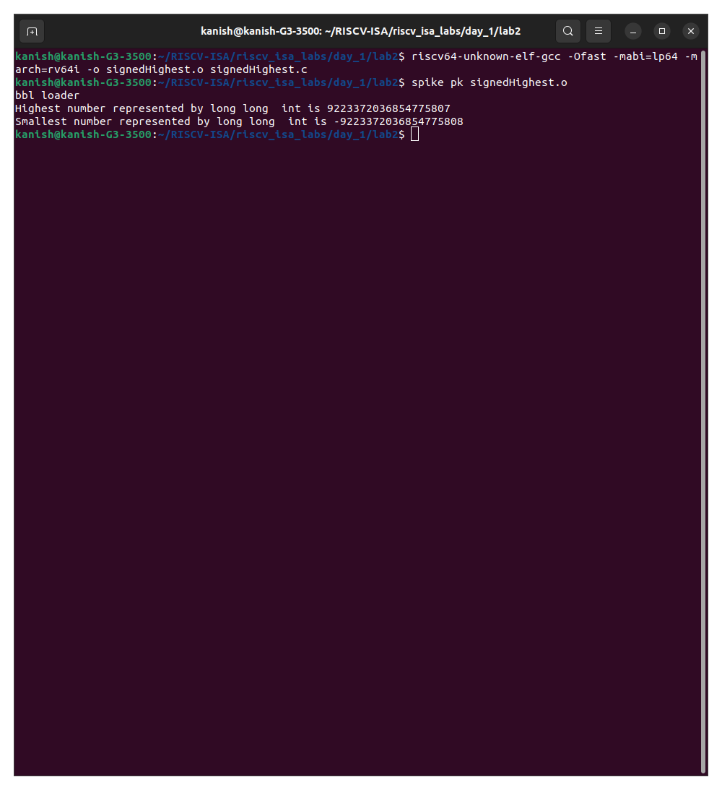

**Different types of format specifiers**

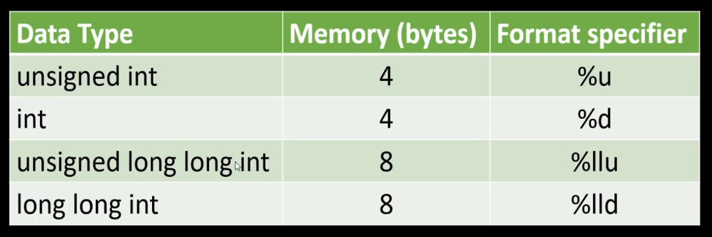


## Day - 2 : Introduction to ABI and Basic Verification Flow

### RV64I Base Integer Instruction Set
RV64I is the base integer instruction set for the 64-bit architecture, which builds upon the RV32I variant. RV64I shares most of the instructions with RV32I but the width of registers is different and there are a few additional instructions only in RV64I. The base integer instruction set has 47 instructions (35 instructions from RV32I and 12 instructions from RV64I). The instructions and their format is shown below :

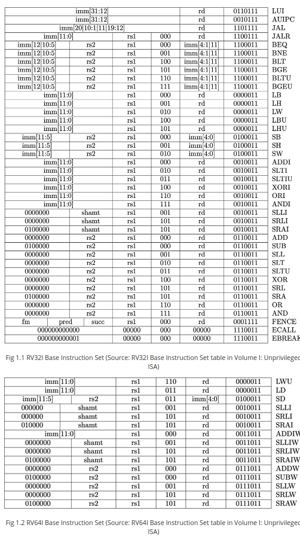

There are 31 general-purpose registers x1–x31, which hold integer values. Register x0 is hardwired to the constant 0. There is no hardwired subroutine return address link register, but the standard software calling convention uses register x1 to hold the return address on a call. For RV32, the x registers are 32 bits wide, and for RV64, they are 64 bits wide. The term XLEN to refer to the current width of an x register in bits (either 32 or 64).

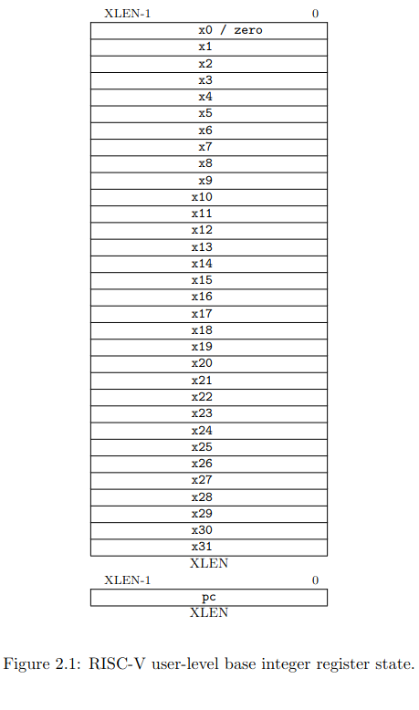

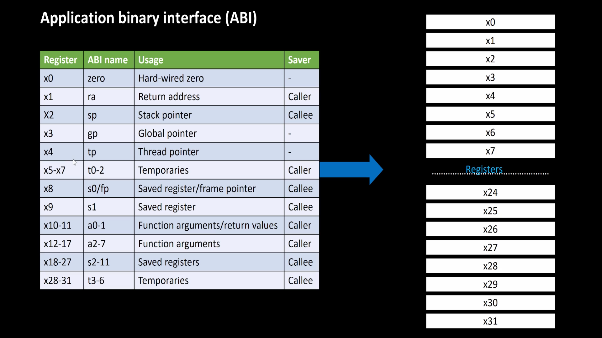

In the RISC-V instruction set architecture, instructions are categorized into different formats based on their opcode and operand types. These formats are denoted by single-letter abbreviations. Here's an explanation of each type:

- **R-Type (Register Type)** -  These instructions involve operations that operate on two source registers and store the result in a destination register. They include arithmetic, logical, and bitwise operations. The typical format is: opcode rd, rs1, rs2.

- **I-Type (Immediate Type)** - These instructions have an immediate (constant) value as one of their operands, and they work with a source register to perform operations like arithmetic, logical, and memory operations. The typical format is: opcode rd, rs1, imm.

- **S-Type (Store Type)** - S-type instructions are used for storing data into memory. They combine a source register, a destination address (base register), and an immediate offset to determine where the data should be stored. The typical format is: opcode rs2, imm(rs1).

- **B-Type (Branch Type)** - B-type instructions are used for conditional branching. They compare values from two source registers and use an immediate offset to determine the branching target. These instructions support operations like equality, inequality, and comparison. The typical format is: opcode rs1, rs2, imm.

- **U-Type (Upper Immediate Type)** - U-type instructions are used for loading immediate values into registers. They include unconditional jump instructions. These instructions operate on a single source register and use an immediate value to specify the upper bits of the result. The typical format is: opcode rd, imm.

- **J-Type (Jump Type)** J-type instructions are used for unconditional jumps. They involve using an immediate offset to determine the target address of the jump. These instructions are typically used for implementing function calls and other control flow changes. The typical format is: opcode rd, imm.

The instruction format for all types is shown below :

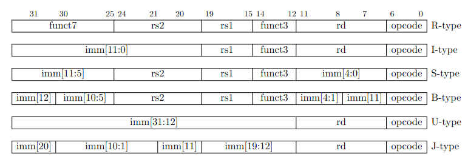

To know more about the instructions check this [link](https://riscv.org/wp-content/uploads/2017/05/riscv-spec-v2.2.pdf).

### Application Binary Interface (ABI)
The ABI is a set of rules that govern how software components, like programs and libraries, interact with each other at the binary level. It defines things like how data is passed between different parts of a program, how function calls are made, and how data structures are organized in memory. The ABI ensures compatibility between different parts of a software ecosystem, making it possible for programs to work together seamlessly even if they're written in different languages or compiled by different compilers. The application program can directly access the registers of the RISC V architecture using system calls. The ABI also known as system call interface enables the application to access the hardware resources via registers.A system call is a specific request your program makes to the operating system to perform a task it can't do on its own. For example, if your program needs to read a file, it would make a system call to ask the operating system to read the file and give it the data. System calls are a way for programs to access the more powerful features of the operating system while staying within the rules defined by the ABI. The ISA is inherently divided into two parts: User & System ISA and User ISA the latter is available to the user directly by system calls.


### Illustration of ABI
Consider the C code given below which calculates the sum from 1 to 9 :
```
#include<stdio.h>

extern int load(int x, int y);

int main()
{
    int result = 0;
    int count = 9;
    result = load(0x0,count+1);
    printf("Sum of numbers from 1 to %d is %d\n",count,result);
    
}
```

Consider the assembly code (ASM) given below :
```
.section .text 
.global load
.type load, @function

load:
    add a4, a0, zero
    add a2, a0, a1
    add a3, a0, zero
loop : add a4, a3, a4
       addi a3, a3, 1
       blt a3, a2, loop
       add a0, a4, zero
       ret
```
The flow chart of the function performed by ASM code is shown below :
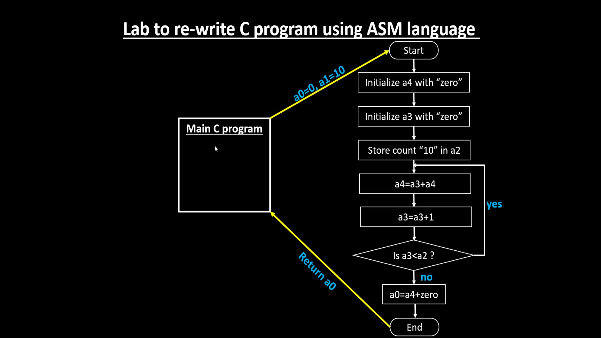

To illustrate the ABI the C code shown above will send the values to the ASM code through the function load and the ASM code will perform the function and return the value to C code and the value is displayed by the C code.

**Steps to perform the lab task mentioned above**
```
cd ~/RISCV-ISA/riscv_isa_labs/day_2/lab1/
riscv64-unknown-elf-gcc -Ofast -mabi=lp64 -march=rv64i -o custom1_to9.o custom1_to_9.c load.S
riscv64-unknown-elf-objdump -d custom1_to9.o | less
spike pk custom1_to9.o
```

**Outputs of the Lab**
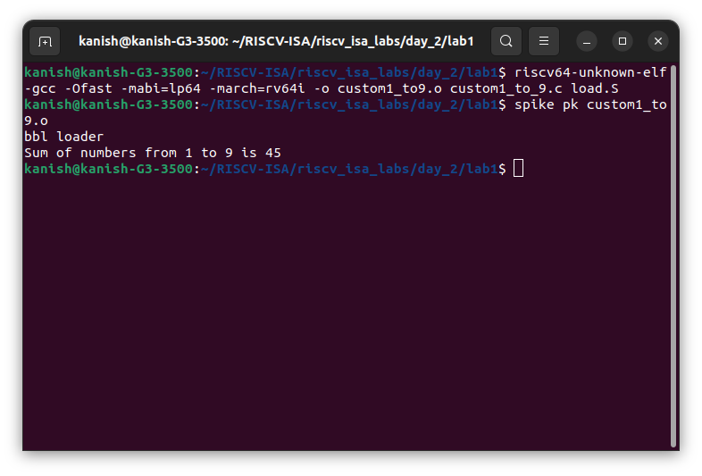

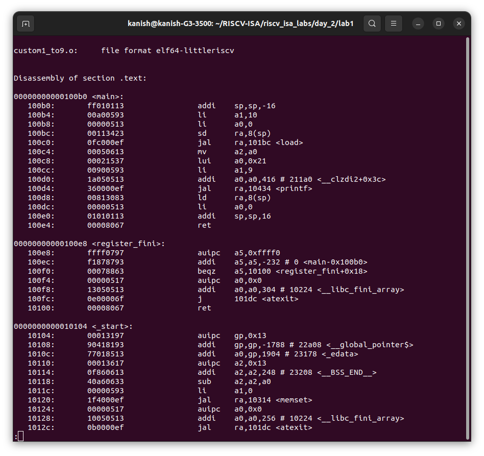

### RISC-V Basic Verification flow using iverilog demo
For verification of the RISC-V CPU the C code will be converted into HEX file and it will be given to the RISC-V CPU and the output will be displayed and verified. The block diagram is shown below :

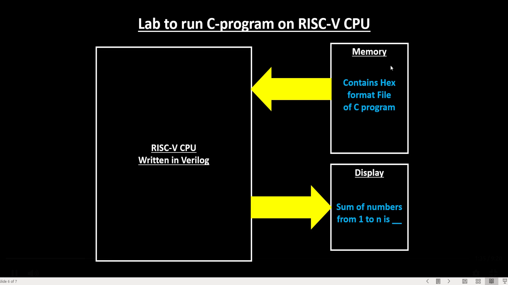

For demo go to the lab directory using the command given below :
```
cd ~/riscv_workshop_collaterals/labs/
chmod 777 rv32im.sh
./rv32im.sh  # Contains necessary commands to convert C to hex
```

**Output, Script(rv32im.sh) and firmare.hex**

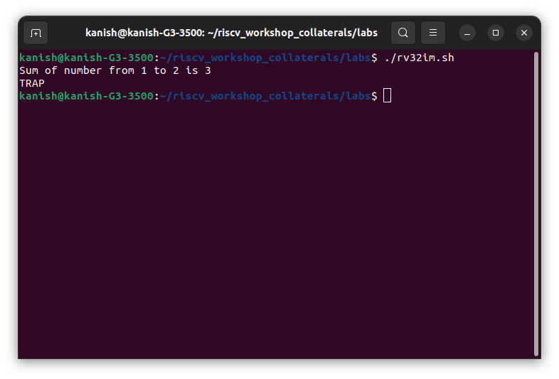

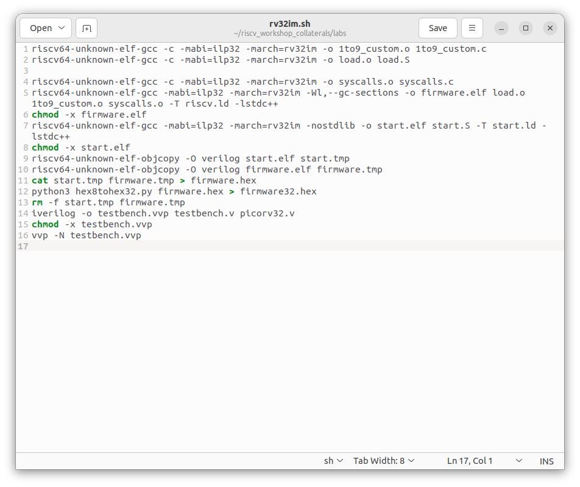

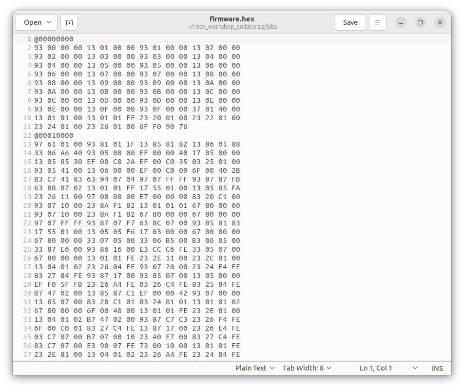


## Day - 3 : Digital Logic with TL-Verilog and Makerchip
### Logic Gates
Logic gates are fundamental building blocks of digital electronic circuits. They are responsible for performing logical operations on input signals and producing output signals based on predefined logic rules. These gates are the foundation of digital computation and are used to design and construct more complex digital systems like processors, memory units, and controllers. Logic gates manipulate binary signals, which are typically represented as "0" and "1". These binary signals correspond to the low and high voltage levels in a digital circuit, respectively. Logic gates take one or more input signals and produce an output signal based on a logical function.

Here are some common types of logic gates:
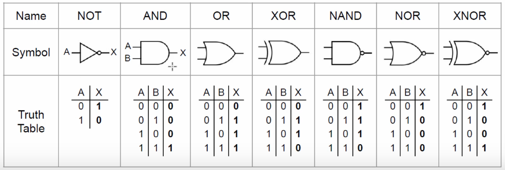

These logic gates can be connected and complex circuits can be made. Two logic gates NAND and NOR gates are called as universal gates. With NAND and NOR gates all other logic gates can be made. The verilog representation of the logic gates is shown below :

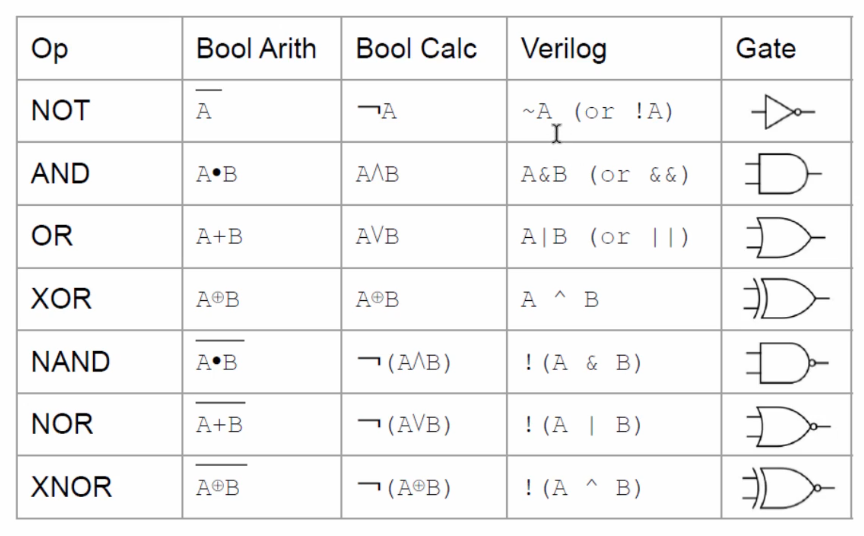


### Multiplexer Using Ternary Operator
Consider the verilog code for multiplexer gicen below :
```
assign f = s ? x1 : x0;
```
This code uses ternary operator that will realize a simple 2:1 multiplexer hardware in which the output f follows x1 if s is 1 otherwise it will follow x0. The harware and logic gate representation l is shown below :

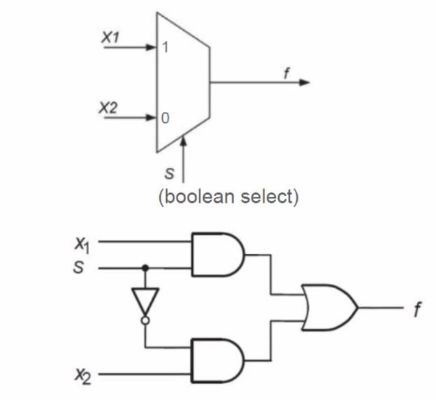

The higher bit multiplexers can also be realized using the coditional operator. Consider the 4:1 multiplexer code given below :

```
assign f = sel[0] ? a : (sel[1] ? b : (sel[2] ? c : d));
```
This code creates a priority for the inputs with input a getting the highest and input d getting the least. Instead of realizing as a single 4:1 multiplexer it will create a series of 2:1 multiplexers. In this case the sel is a one hot vector i.e, only one of the bit in the sel will be high at a time. The hardware realization is shown below :

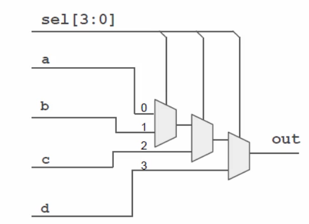

### Transaction Level(TL) - Verilog
TL-Verilog is a Verilog implementation of TL-X, a language extension that extends any HDL with transaction-level modeling. TL-Verilog was developed by Redwood EDA, and it's designed to enable more efficient and concise design representation while retaining compatibility with standard Verilog. It eliminates the need for the legacy language features of Verilog and introduces simpler syntax. TL-Verilog is specifically designed for modeling hardware and provides abstract context suited to hardware design with numerous benefits. It is built for the design process, not for the mere description of static designs. In transaction-level design, a transaction is an entity that moves through a microarchitecture and is operated upon and steered through the machinery by flow components such as pipelines, arbiters, and queues. TL-Verilog is the easiest way to write and edit Verilog with fewer bugs and is supported by Makerchip.

### Makerchip IDE
Makerchip IDE is an integrated development environment specifically designed for digital design and hardware description language (HDL) programming. It offers a comprehensive platform for engineers, students, and hobbyists to design, simulate, and test digital circuits and systems. Makerchip IDE stands out for its user-friendly interface and its ability to support various HDLs like TL Verilog, SystemVerilog, Verilog, and VHDL. Within the Makerchip IDE, users can design complex digital systems by using a combination of pre-built and custom logic elements such as logic gates, flip-flops, multiplexers, and more. It provides a virtual canvas where users can visually construct their designs by interconnecting these components. One of the notable features of Makerchip IDE is its real-time simulation capability, allowing users to simulate their designs and observe their behavior before moving on to actual hardware implementation. This virtual prototyping helps catch errors early and refine designs efficiently. Overall, Makerchip IDE serves as an invaluable tool for both beginners and experienced digital designers to explore, learn, and experiment with digital logic design, fostering innovation and advancement in the field of digital electronics.

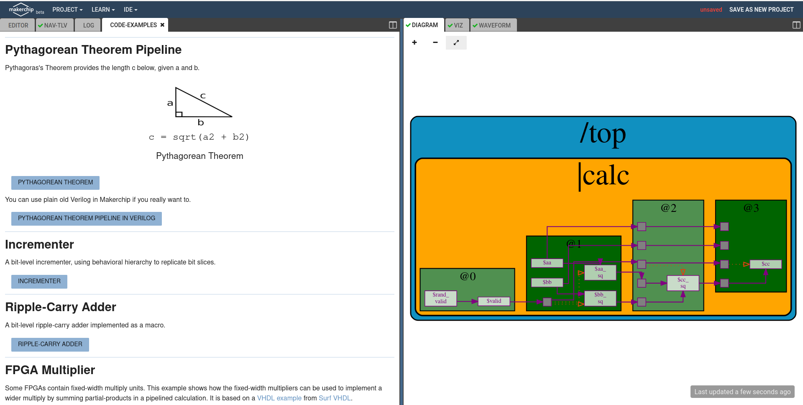

### Basic Combinational Circuits in Makerchip

#### Pythagorean Example Demo

___
***Note**</br>
Unlike verilog, no need to declare $in and $out ports.
In Maketrchip three space indentation must be preserved.
___

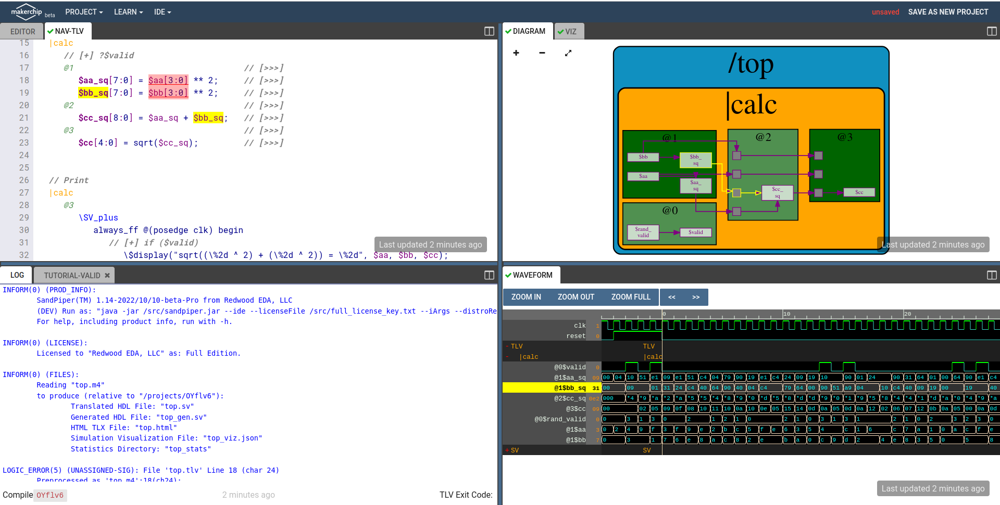

#### Inverter

The TL-Verilog code is shown below :
```
   $out = $in;
```

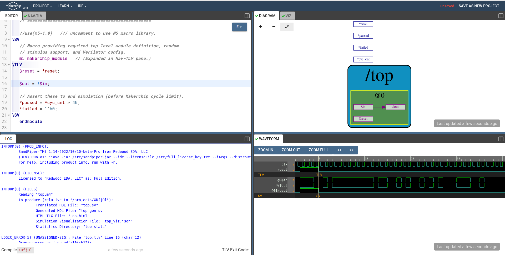

#### AND gate

The TL-Verilog code is shown below :
```
   $out = $in1 && $in2;
```


#### OR gate

The TL-Verilog code is shown below :
```
   $out = $in1 || $in2;
```


#### XOR gate

The TL-Verilog code is shown below :
```
   $out = $in1 ^ $in2;
```


#### Vector Addition

The TL-Verilog code is shown below :
```
   $out[5:0] = $in1[4:0] + $in2[4:0];
```
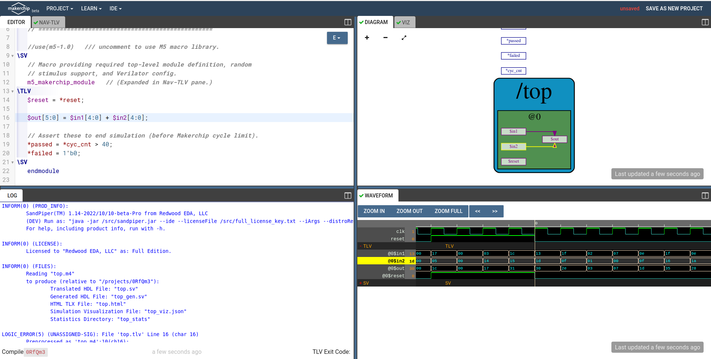

#### 2:1 Multiplexer

The TL-Verilog code is shown below :
```
   $out = $sel ? $in1 : $in0;
```


#### 2:1 Vector Multiplexer

The TL-Verilog code is shown below :
```
   $out[7:0] = $sel ? $in1[7:0] : $in0[7:0];
```


#### Calculator

The TL-Verilog code is shown below :
```
   $reset = *reset;
   $op[1:0] = $random[1:0];
   
   $val1[31:0] = $rand1[3:0];
   $val2[31:0] = $rand2[3:0];
   $sum[31:0] = $val1+$val2;
   $diff[31:0] = $val1-$val2;
   $prod[31:0] = $val1*$val2;
   $div[31:0] = $val1/$val2;
   
   $out[31:0] = $op[1] ? ($op[0] ? $div : $prod):($op[0] ? $diff : $sum);
```
The function table is given below :

| Opcode | Function|
| :------: | :-------: |
| 2'b00 | Addition |
| 2'b01 | Subtraction |
| 2'b10 | Multiplication |
| 2'b11 | Division |


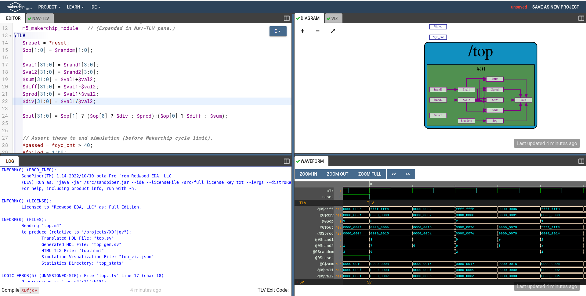

### Sequential Circuits
A sequential circuit is a type of digital circuit that employs memory elements to store information and produce outputs based not only on the current input values but also on the circuit's previous state. Unlike combinational circuits, which generate outputs solely based on the present input values, sequential circuits incorporate feedback loops and memory elements like flip-flops or registers to maintain and utilize their internal state.


### Basic Sequential Circuits in Makerchip

#### Fibonacci Series

The TL-Verilog code for fibonacci series is shown below :
```
   $reset = *reset;
   $num[31:0] = $reset ? 1 : (>>1$num + >>2$num);
```

___
1 - Indicates the previous value of num
2 - Value of num before 2 clock cycle
___

The block diagram of the fibonacci series generator is shown below :
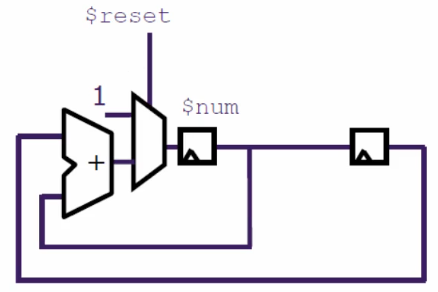

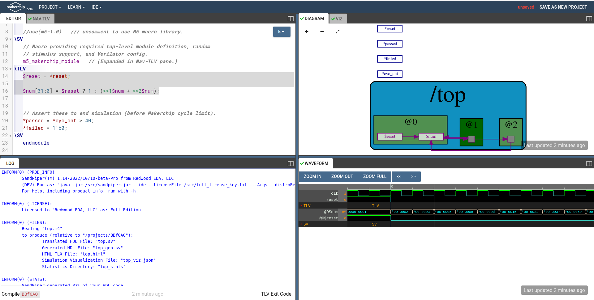

#### Free running counter

The TL-Verilog code for free running counter is shown below :
```
   $reset = *reset;
   $cnt[31:0] = $reset ? 0 : (>>1$cnt + 1);
```
The block diagram of the free running counter is shown below :
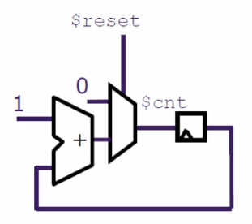

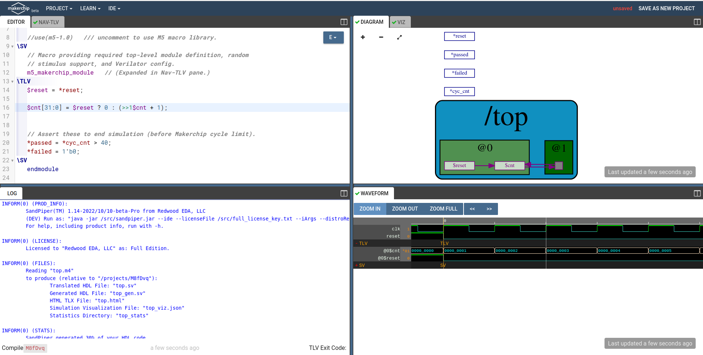


#### Counter-Output with Calculator  Integration
The TL-Verilog code is shown below :
```
   reset = *reset;
   
   $cnt1[31:0] = $reset ? 0 : (>>1$cnt1 + 3);
   $cnt2[31:0] = $reset ? 0 : (>>1$cnt2 + 4);
   $cnt3[1:0] = $reset ? 0 : (>>1$cnt3 + 1);
   
   $op[1:0] = $cnt3;
   
   $val1[31:0] = $cnt1;
   $val2[31:0] = $cnt2;
   $sum[31:0] = $val1+$val2;
   $diff[31:0] = $val1-$val2;
   $prod[31:0] = $val1*$val2;
   $div[31:0] = $val1/$val2;
   
   $out[31:0] = $op[1] ? ($op[0] ? $div : $prod):($op[0] ? $diff : $sum);
```

[calc_int](./riscv_isa_labs/day_3/lab2/images/calc_int.png)

#### Sequential Calculator
The TL-verilog code for sequential calculator is shown below :
```
   $reset = *reset;
   
   $cnt2[2:0] = $reset ? 0 : (>>1$cnt2 + 1);
   $cnt3[1:0] = $reset ? 0 : (>>1$cnt3 + 1);
   
   $op[1:0] = $cnt3;
   
   $val1[31:0] = >>1$out;
   $val2[31:0] = $cnt2;
   $sum[31:0] = $val1+$val2;
   $diff[31:0] = $val1-$val2;
   $prod[31:0] = $val1*$val2;
   $div[31:0] = $val1/$val2;
   
   $out[31:0] = $reset ? 32'h0 : ($op[1] ? ($op[0] ? $div : $prod):($op[0] ? $diff : $sum));
```

This code works like the normal calculator in which the result of the previous operation is considered as one of the operand for the next operation. Upon reset the result becomes zero.

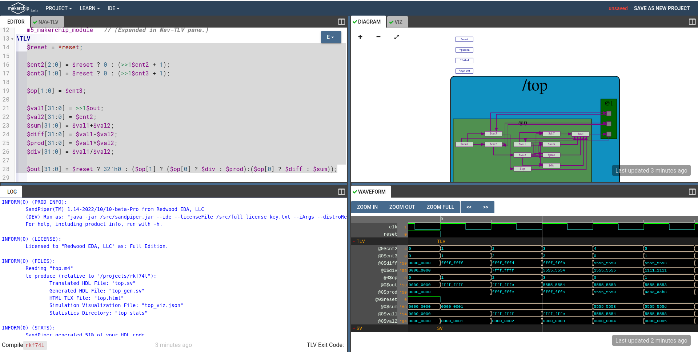


### Pipelining
Pipelining is a technique used in computer architecture and digital system design to enhance the efficiency of processing by dividing a complex task into smaller, sequential stages. Each stage performs a specific operation on the data, and these stages are arranged in a pipeline. Pipelining enables multiple instructions or tasks to be executed concurrently, with different stages of different instructions being processed simultaneously. In a pipelined architecture, the processing of an instruction is divided into several stages. This allows for overlapping the execution of multiple instructions, reducing the overall time needed to complete a sequence of tasks.

### Identifiers and Types in TL-Verilog
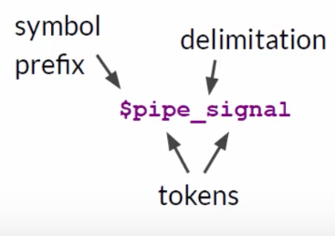

TL-Verilog uses strict naming semantics. Always first token must start with two alpha characters. Identifiers can have basically three types of delimitation or casing.
1. $lower_case - Pipe signal
2. $CamelCase - State signal
3. $Upper_CASE - Keyword signal

The identifiers can have numbers at the end of tokens like $base64_value, but not $base_64.
### Basic Pipelined Circuits

#### Pipelined Pythagorean
The TL-Verilog code is given below:
```
\m5_TLV_version 1d: tl-x.org
\m5
   
   // =================================================
   // Welcome!  New to Makerchip? Try the "Learn" menu.
   // =================================================
   
   //use(m5-1.0)   /// uncomment to use M5 macro library.
\SV
   // Macro providing required top-level module definition, random
   // stimulus support, and Verilator config.
   m5_makerchip_module   // (Expanded in Nav-TLV pane.)
   
   `include "sqrt32.v"
\TLV
   $reset = *reset;
   $aa = $rand1[3:0];
   $bb = $rand2[3:0];
   |calc
      @1
         $aa_sq[31:0] = $aa * $aa;
      @2
         $bb_sq[31:0] = $bb * $bb;
      @3
         $cc_sq[31:0] = $aa_sq + $bb_sq;
      @4
         $out[31:0] = sqrt($cc_sq);
   
   // Assert these to end simulation (before Makerchip cycle limit).
   *passed = *cyc_cnt > 40;
   *failed = 1'b0;
\SV
   endmodule
```
 ___
 **@** - Represents the pipelined stage number.
 
 **|** - Represent the code below are pipelined 
 
 The square root code is given in sqrt32.v file, which is present by default in the makerchip ide.
 ___

 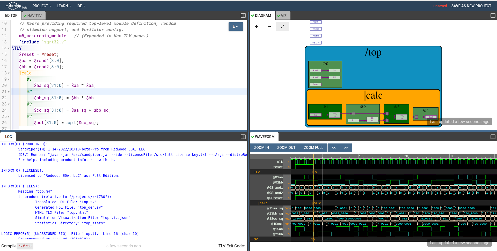

#### Error Detection Demo
The TL-Verilog code is given below :
```
|comp
      @1
         $err1 = $bad_input || $illegeal_op;
      @3
         $err2 = $err1 || $over_flow;
      @6
         $err3 = $err2 || $div_by_zer0;

```

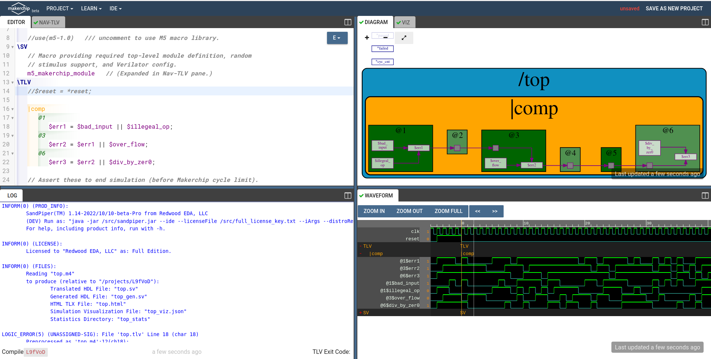

#### Counter and Calculator in Pipeline
The block diagram of the counter with calculator in pipeline is shown below :
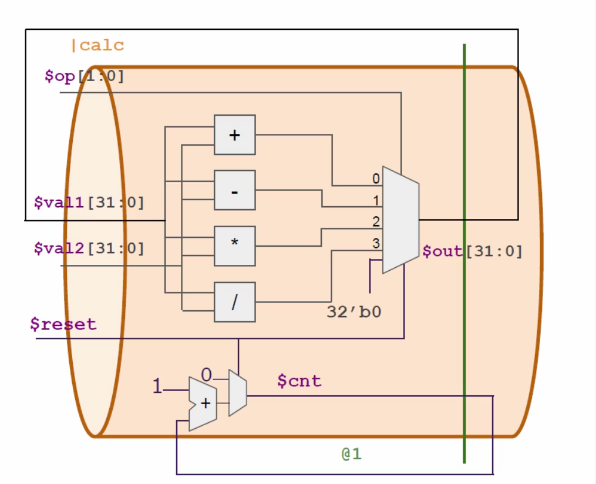

The TL-Verilog code is given below :
```
   $reset = *reset;
   $op[1:0] = $random[1:0];
   $val2[31:0] = $rand2[3:0];
   
   |calc
      @1
         $val1[31:0] = >>1$out;
         $sum[31:0] = $val1+$val2;
         $diff[31:0] = $val1-$val2;
         $prod[31:0] = $val1*$val2;
         $div[31:0] = $val1/$val2;
         $out[31:0] = $reset ? 32'h0 : ($op[1] ? ($op[0] ? $div : $prod):($op[0] ? $diff : $sum));
         
         $cnt[31:0] = $reset ? 0 : (>>1$cnt + 1); 

```


#### 2 Cycle Calculator
The block diagram of the 2 cycle calculator is shown below:
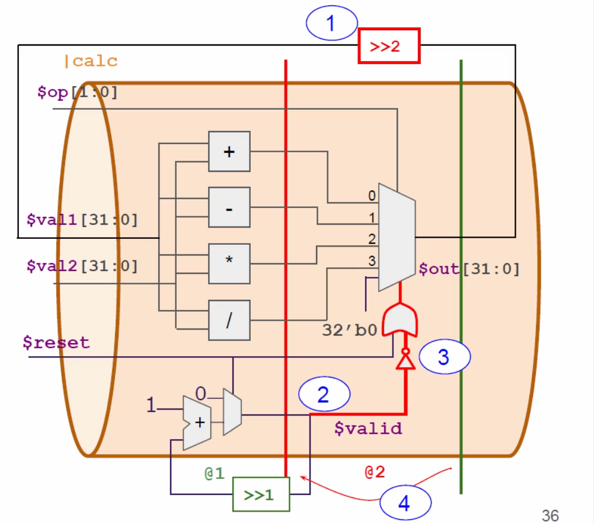

The TL-verilog code is shown below :
```
   $reset = *reset;
   $op[1:0] = $random[1:0];
   $val2[31:0] = $rand2[3:0];
   
   |calc
      @1
         $val1[31:0] = >>2$out;
         $sum[31:0] = $val1+$val2;
         $diff[31:0] = $val1-$val2;
         $prod[31:0] = $val1*$val2;
         $div[31:0] = $val1/$val2;
         $valid = $reset ? 0 : (>>1$valid + 1);
      @2
         $out[31:0] = ($reset | ~($valid))  ? 32'h0 : ($op[1] ? ($op[0] ? $div : $prod):($op[0] ? $diff : $sum));
```

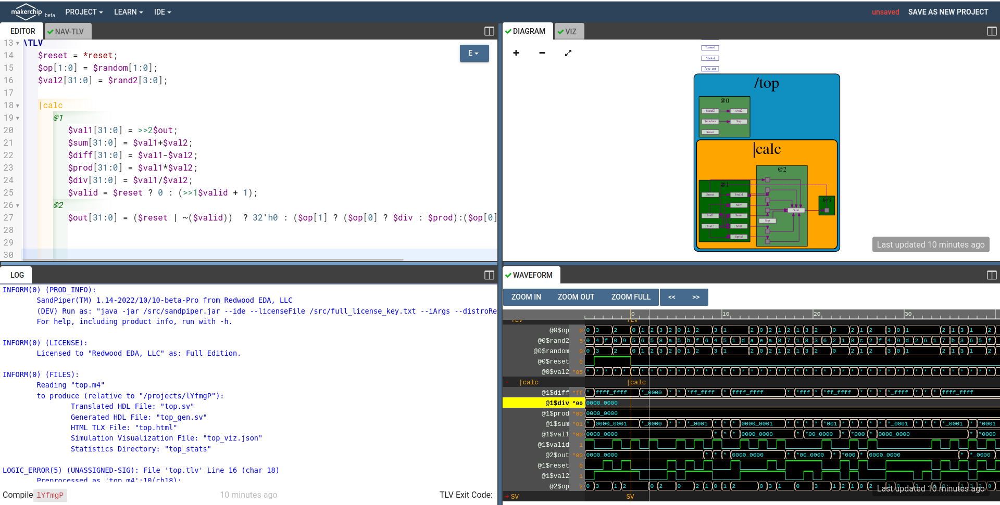

### Validity
In Transaction-Level Verilog (TL-Verilog), validity is a concept used to track the state and timing of transactions within a design description. In TL-Verilog, transactions are used to represent higher-level actions or events that occur in a design. A transaction typically consists of a set of signals that represent the data and control information associated with that action. Validity, refers to whether a transaction is considered "valid" or "invalid" based on the state of its associated signals.
### Clock Gating
Clock gating is a power-saving technique used in digital circuit design to reduce power consumption by controlling the clock signal distribution to specific circuit blocks. The goal of clock gating is to minimize unnecessary clock transitions in parts of a circuit that are not actively performing computations or tasks, thus conserving energy. In digital systems, the clock signal is used to synchronize the operations of various components within the circuit. However, not all components need to be active and consuming power during every clock cycle. In fact, many components spend a significant amount of time in idle or low-power states. Clock gating takes advantage of this fact by selectively enabling or disabling the clock signal to certain portions of the circuit based on their activity status. The basic idea of clock gating involves inserting a logic gate (often an AND gate) in the clock path. The control signal for this gate determines whether the clock signal is allowed to pass through or not. If the control signal is active (high), the clock gate is open, and the clock signal reaches the circuit block. If the control signal is inactive (low), the clock gate is closed, effectively stopping the clock from reaching the circuit block.

### Illustration of Validity

#### Distance Accumulator
The block diagram of the distance accumulator is shown below :

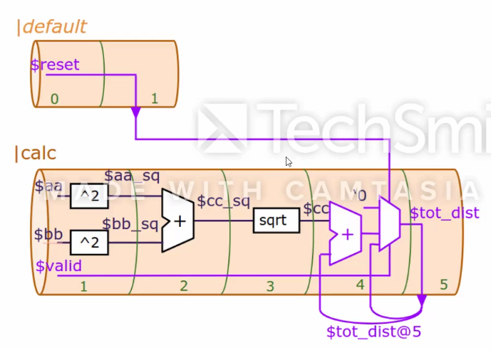

The TL-Verilog code is given below:
``` 
    calc
      @1
         $reset = *reset;
      ?$valid
         @1
            $aa_sq[31:0] = $aa[3:0] * $aa;
            $bb_sq[31:0] = $bb[3:0] * $bb;
         @2
            $cc_sq[31:0] = $aa_sq + $bb_sq;
         @3
            $out[31:0] = sqrt($cc_sq);
      @4
         $tot_dist[31:0] = $reset ? '0 : ($valid ? (>>1$tot_dist + $out) : $RETAIN);
```

Once the valid signal is asserted the previous value of result will be added with the current value and it result will get updated otherwise the previous value is retained.


#### 2 Cycle Calculator with Validity
The block diagram of 2 Cycle calculator with validity is shown below :

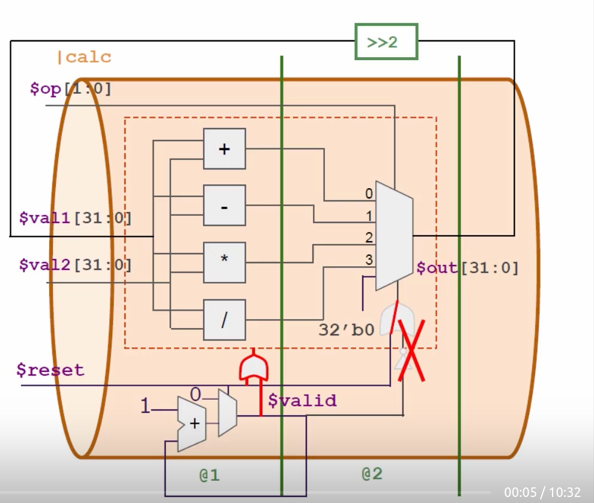

The TL-Verilog code is given below :
```
   $reset = *reset;
   |calc
      @1
         $valid = $reset ? 0 : >>1$valid+1;
         $valid_or_reset = $valid || $reset;
      ?$valid_or_reset
         @1
            $val1[31:0] = >>2$out;
            $sum[31:0] = $val1+$val2;
            $diff[31:0] = $val1-$val2;
            $prod[31:0] = $val1*$val2;
            $div[31:0] = $val1/$val2;
            $valid = $reset ? 0 : (>>1$valid + 1);
         @2
            $out[31:0] = $reset  ? 32'h0 : ($op[1] ? ($op[0] ? $div : $prod):($op[0] ? $diff : $sum));
```

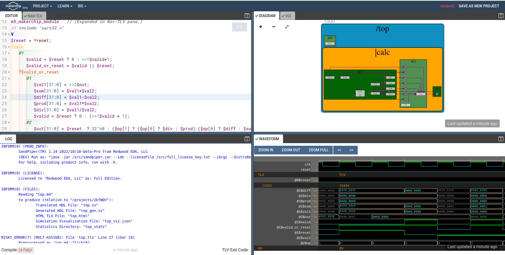

#### Calculator with Single Value Memory
The block diagram of calculator with single value memory is shown below :

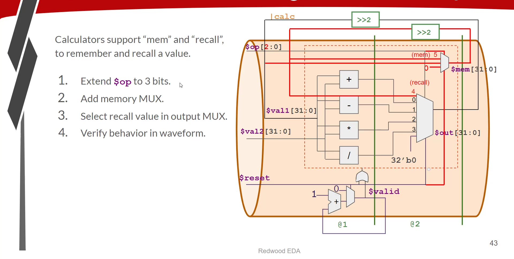

The TL-Verilog code is given below:
```
   |calc
      @0
         $reset = *reset;
         
      @1
         $val1 [31:0] = >>2$out;
         $val2 [31:0] = $rand2[3:0];
         
         $valid = $reset ? 1'b0 : >>1$valid + 1'b1 ;
         $valid_or_reset = $valid || $reset;
         
      ?$vaild_or_reset
         @1   
            $sum [31:0] = $val1 + $val2;
            $diff[31:0] = $val1 - $val2;
            $prod[31:0] = $val1 * $val2;
            $div[31:0] = $val1 / $val2;
            
         @2   
            $mem[31:0] = $reset ? 32'b0 :
                         ($op[2:0] == 3'b101) ? $val1 : >>2$mem ;
            
            $out [31:0] = $reset ? 32'b0 :
                          ($op[2:0] == 3'b000) ? $sum :
                          ($op[2:0] == 3'b001) ? $diff :
                          ($op[2:0] == 3'b010) ? $prod :
                          ($op[2:0] == 3'b011) ? $quot :
                          ($op[2:0] == 3'b100) ? >>2$mem : >>2$out ;

```
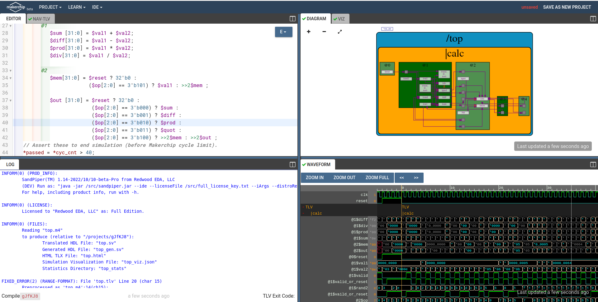


[Acknowledgement Section]:#
## Acknowledgement
1. Kunal Ghosh, VSD Corp. Pvt. Ltd.
2. Sumanto Kar, Sr. Project Technical Assistant , IIT Bombay
3. Alwin Shaju, Colleague IIITB
4. Adam Teman, Associate Professor at Bar-Ilan University in Ramat Gan, Israel  
5. Pruthvi Parate, Colleague IIITB
6. Emil Jayanth Lal, Colleague IIITB
7. Bhargav D V, Colleague IIITB 


[Reference Section]:#
## References
1. https://www.eng.biu.ac.il/temanad/digital-vlsi-design/
2. https://www.arm.com/glossary/isa
3. https://riscv.org/wp-content/uploads/2017/05/riscv-spec-v2.2.pdf
4. https://gcc.gnu.org/onlinedocs/gcc/RISC-V-Options.html
5. https://www.tutorialspoint.com/unsigned-and-signed-binary-numbers
6. https://book.rvemu.app/instruction-set/01-rv64i.html